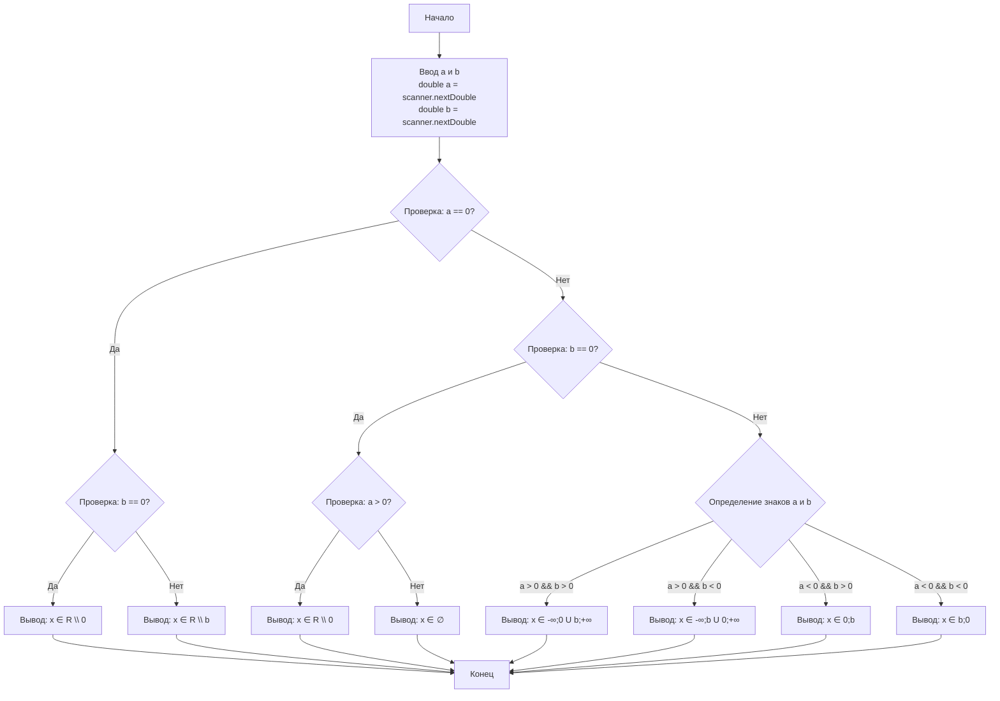

## Отчет по лабораторной работе № 1

#### № группы: `ПМ-2502`

#### Выполнил: `Калинкин Василий Артёмович`

#### Вариант: `8`

### Cодержание:

- [Постановка задачи](#1-постановка-задачи)
- [Входные и выходные данные](#2-входные-и-выходные-данные)
- [Выбор структуры данных](#3-выбор-структуры-данных)
- [Алгоритм](#4-алгоритм)
- [Программа](#5-программа)
- [Анализ правильности решения](#6-анализ-правильности-решения)

### 1. Постановка задачи

> Программа получает на вход 2 вещественных числа a и b.
> Нужно решить неравество $a\frac{x}{x-b} ≥ 0$

Данную задачу можно разделить на рассмотрение 8 случаев, влияющих на образование интервалов решения.

1. A = 0, B = 0, x ∈ R \ 0
2. A = 0, B ≠ 0, x ∈ R \ b
3. A > 0, B = 0, x ∈ R \ 0
4. A < 0, B = 0, x ∈ ∅
5. A > 0, B > 0, x ∈ (-∞; 0] U (b; +∞)
6. A < 0, B < 0, x ∈ (b; 0]
7. A > 0, B < 0, x ∈ (-∞; b) U [0; +∞)
8. A < 0, B > 0, x ∈ [0; b)

### 2. Входные и выходные данные

#### Данные на вход

На вход программа должна получать 2 числа, при этом в условии не сказано, к какому множеству
принадлежать получаемые числа, поэтому будем считать их вещественными. Также даны верхняя и нижняя границы получаемых
чисел.

|             | Тип                | min значение    | max значение   |
|-------------|--------------------|-----------------|----------------|
| A (Число 1) | Вещественное число | -10<sup>9</sup> | 10<sup>9</sup> |
| B (Число 2) | Вещественное число | -10<sup>9</sup> | 10<sup>9</sup> |

#### Данные на выход

Т.к. программа должна вывести решение неравенства для х относительно введенных чисел, то на выход мы получим интервал или отрезок.

|         | Тип                | min значение | max значение   |
|---------|--------------------|--------------|----------------|
| Строка  | Строковый тип      |              |                |

### 3. Выбор структуры данных

Программа получает 2 вещественных числа, не превышающих по модулю 1,7*10<sup>308</sup>. Поэтому для их хранения
можно выделить 2 переменных (`a` и `b`) типа `double`.

|             | название переменной | Тип (в Java) | 
|-------------|---------------------|--------------|
| A (Число 1) | `a`                 | `double`     |
| B (Число 2) | `b`                 | `double`     | 

Для вывода результата необязательно его хранить в отдельной переменной.

### 4. Алгоритм

#### Алгоритм выполнения программы:

1. **Ввод данных:**  
   Программа считывает два вещественных числа, обозначенные как `a` и `b`.

2. **Сравнение чисел:**  
   Программа сравнивает значения `a` и `b`. В зависимости от значений чисел относительно нуля программа переходит к этапу и выводит определенные значение.

4. **Вывод результата:**  
   На экран выводится либо большее из чисел, либо его модуль, если это число отрицательное.

#### Блок-схема



### 5. Программа

```java
import java.util.Scanner;

public class Lesson1 {
    public static void main(String[] args) {
        //ввод чисел с консоли
        Scanner scanner = new Scanner(System.in);
        double a = scanner.nextDouble();
        double b = scanner.nextDouble();
        //вывод чисел

        //решение уравнения a*x = 0
        int x1 = 0;
        //решение уравнения x-b = 0
        double x2 = b;

        //если введённое число а = 0, b = 0
        if (a == 0) {
            System.out.println(b == 0 ? "x ∈ R \\ 0" : "x ∈ R \\ " + b);
            return;
        }
        
        else if(a > 0 && b == 0){
            String message = "x ∈ R \\ 0";
            System.out.println(message);
        }
        else if(a < 0 && b == 0){
            String message = "x ∈ ∅";
            System.out.println(message);
        }
        else if(a > 0 && b > 0){
            String message = String.format("x ∈ (-∞; 0] U ( " + x2 + "; +∞)");
            System.out.println(message);
        }
        else if(a < 0 && b < 0){
            String message = String.format("x ∈ (" +x2 + "; 0]");
            System.out.println(message);
        }
        else if(a > 0 && b < 0) {
            String message = String.format("x ∈ (-∞; " + x2 + ") U [0; +∞)");
            System.out.println(message);
        }
        else if(a < 0 && b > 0) {
            String message = String.format("x ∈ [0; " + x2 + ")");
            System.out.println(message);
        }
    }
}
```

```
import java.util.Scanner;

public class Lesson1 {
    public static void main(String[] args) {
        Scanner scanner = new Scanner(System.in);
        double a = scanner.nextDouble();
        double b = scanner.nextDouble();
        
        // Решение уравнения a*x = 0
        int x1 = 0;
        // Решение уравнения x-b = 0
        double x2 = b;
        
        // Если введённое число а = 0
        if (a == 0) {
            System.out.println(b == 0 ? "x ∈ R \\ 0" : "x ∈ R \\ " + b);
            return;
        }
        
        // Основная логика через условия, но без каскада else-if
        String message;
        
        if (b == 0) {
            message = (a > 0) ? "x ∈ R \\ 0" : "x ∈ ∅";
        } 
        else if (a > 0 && b > 0) {
            message = String.format("x ∈ (-∞; 0] U (%.2f; +∞)", x2);
        } 
        else if (a < 0 && b < 0) {
            message = String.format("x ∈ (%.2f; 0]", x2);
        } 
        else if (a > 0 && b < 0) {
            message = String.format("x ∈ (-∞; %.2f) U [0; +∞)", x2);
        } 
        else { // a < 0 && b > 0
            message = String.format("x ∈ [0; %.2f)", x2);
        }
        
        System.out.println(message);
    }
}
```

### 6. Анализ правильности решения

Программа работает корректно на всем множестве решений с учетом ограничений.

1. Тест на `X, Y > 0`:

    - **Input**:
        ```
        5 6
        ```

    - **Output**:
        ```
        x ∈ (-∞; 0] U ( 6.0; +∞)
        ```

2. Тест на `X, Y < 0`:

    - **Input**:
        ```
        -3 -1,3
        ```

    - **Output**:
        ```
        x ∈ (-1.3; 0]
        ```

3. Тест на `X < 0, 0 < Y`:

    - **Input**:
        ```
        -5 8
        ```

    - **Output**:
        ```
        x ∈ [0; 8.0)
        ```

4. Тест на `X > 0, Y < 0`:

    - **Input**:
        ```
        1888 -4
        ```

    - **Output**:
        ```
        x ∈ (-∞; -4.0) U [0; +∞)
        ```

5. Тест на ограничение задачи:

    - **Input**:
        ```
        -1000000000 1000000000
        ```

    - **Output**:
        ```
        x ∈ [0; 1.0E9)
        ```
